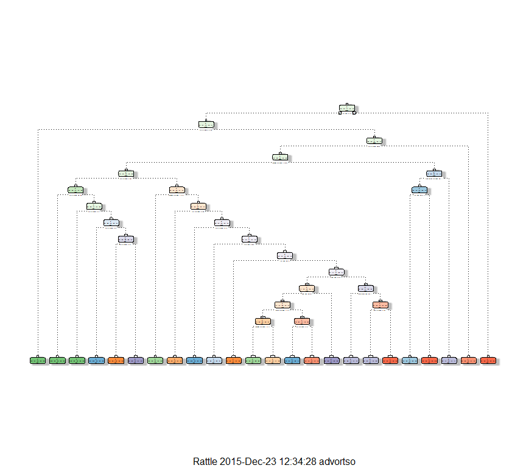

# Description
O.Dvortsova  
23 December 2015  

The goal of the assignment was to build the prediction model for "classe" variable. The model should be validated. Finally, using the model the prediction of the provided test sets should be performed. Data was provided from this source: http://groupware.les.inf.puc-rio.br/har.
Setting seed for reproducability purposes 


```r
set.seed(4566)
```

Downloading data

```r
getwd()
```

```
## [1] "C:/Users/advortso/Documents/data/wga"
```

```r
download.file("https://d396qusza40orc.cloudfront.net/predmachlearn/pml-training.csv",destfile="./train.csv")
train_data<-read.csv("./train.csv")
download.file("https://d396qusza40orc.cloudfront.net/predmachlearn/pml-testing.csv",destfile="./test.csv")
validation_data<-read.csv("./test.csv")
```
Deleting empty and NA rows, since data has strange half empty variables 

```r
train_data[train_data == ""] <- NA                                                   
g=colnames(train_data)[colSums(is.na(train_data)) == 0]
reduced_train<-train_data[,g]
dim(reduced_train)
```

```
## [1] 19622    60
```

Building train and test sets

```r
library(caret)
```

```
## Loading required package: lattice
## Loading required package: ggplot2
```

```r
inTrain <- createDataPartition(y=reduced_train$classe,
                               p=0.75, list=FALSE)
training <- reduced_train[inTrain,7:60]
testing <- reduced_train[-inTrain,7:60]
dim(training)
```

```
## [1] 14718    54
```

```r
dim(testing)
```

```
## [1] 4904   54
```
Fitting decision trees algorithm

```r
library(rpart)
library(rattle)
```

```
## Rattle: A free graphical interface for data mining with R.
## Version 4.0.5 Copyright (c) 2006-2015 Togaware Pty Ltd.
## Type 'rattle()' to shake, rattle, and roll your data.
```

```r
library(rpart.plot)
modelFit <- rpart(classe ~ ., data=training, method="class")
```
Example of the visualisation of the decision tree
 


Out-sample testing of the model

```r
test_prediction <- predict(modelFit, testing, type = "class")
confusionMatrix(test_prediction, testing$classe)
```

```
## Confusion Matrix and Statistics
## 
##           Reference
## Prediction    A    B    C    D    E
##          A 1279  144   39   31    8
##          B   70  655   46   26   24
##          C   20  101  710   80   54
##          D   18   33   60  610   80
##          E    8   16    0   57  735
## 
## Overall Statistics
##                                           
##                Accuracy : 0.8134          
##                  95% CI : (0.8022, 0.8242)
##     No Information Rate : 0.2845          
##     P-Value [Acc > NIR] : < 2.2e-16       
##                                           
##                   Kappa : 0.7635          
##  Mcnemar's Test P-Value : < 2.2e-16       
## 
## Statistics by Class:
## 
##                      Class: A Class: B Class: C Class: D Class: E
## Sensitivity            0.9168   0.6902   0.8304   0.7587   0.8158
## Specificity            0.9367   0.9580   0.9370   0.9534   0.9798
## Pos Pred Value         0.8521   0.7978   0.7358   0.7615   0.9007
## Neg Pred Value         0.9659   0.9280   0.9632   0.9527   0.9594
## Prevalence             0.2845   0.1935   0.1743   0.1639   0.1837
## Detection Rate         0.2608   0.1336   0.1448   0.1244   0.1499
## Detection Prevalence   0.3061   0.1674   0.1968   0.1633   0.1664
## Balanced Accuracy      0.9268   0.8241   0.8837   0.8561   0.8978
```
Seperate testing data set prediction

```r
validation_pred <- predict(modelFit, validation_data, type = "class")
validation_pred
```

```
##  1  2  3  4  5  6  7  8  9 10 11 12 13 14 15 16 17 18 19 20 
##  B  A  C  A  A  C  D  C  A  A  A  C  B  A  D  E  A  A  B  B 
## Levels: A B C D E
```


